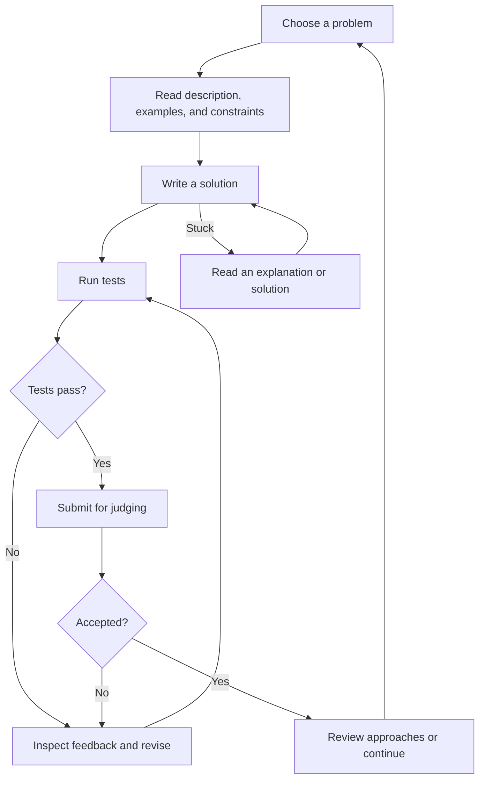

# LeetCode Product Analysis

Research date: September 7, 2026

## Overview

LeetCode’s core product is a coding practice loop:

**Choose a problem → write code → get automated feedback → learn → repeat.**

Interview preparation gives that loop a purpose; progress and competition encourage users to return.

This analysis is based on LeetCode’s public product pages and documentation. Statements about the main or most-used flow are product inferences, not verified usage rankings: internal analytics were not available. The practice guide is older documentation, while the current problem page confirms the main workspace components.

## Core features

| Feature | What users do | Product role |
|---|---|---|
| Problem discovery | Search and filter problems, or select from saved lists | Helps users decide what to practice |
| Coding workspace | Read the problem, examples, and constraints; choose a language and write code | The main working surface |
| Run and submit | Test sample/custom inputs, then submit for automated judging | Delivers immediate feedback |
| Explanations and solutions | Read editorials and community approaches | Turns an attempt into learning |
| Study plans | Follow a curated sequence such as LeetCode 75 | Reduces planning effort |
| Progress tracking | Review submission history and progress through problem sets | Supports continuity and motivation |

The problem page brings description, editorial, solutions, submissions, code, and test results together. This makes it the center of the experience. Sources: [Two Sum problem page](https://leetcode.com/problems/two-sum/) and [coding practice guide](https://support.leetcode.com/hc/en-us/articles/360012016874-Start-your-Coding-Practice).

Study plans add structure and completion rewards. For example, LeetCode 75 offers a curated interview-preparation list and a completion badge. Source: [LeetCode 75](https://leetcode.com/studyplan/leetcode-75/).

## Main user flow: practice one problem

1. **Choose a problem.** Arrive from a problem list, study plan, or direct link.
2. **Understand the task.** Read the description, examples, and constraints.
3. **Develop a solution.** Choose a language and implement an approach.
4. **Run tests.** Inspect outputs and errors; adjust the code.
5. **Submit.** Have the solution judged against the broader test suite.
6. **Respond to the result.** A failed submission leads back to debugging. An accepted submission leads to reviewing approaches or moving on. If stuck, consult an explanation and return to the implementation.
7. **Continue practicing.** Select the next problem or return later.

**Run** supports experimentation on selected inputs. **Submit** evaluates the solution more broadly through the online judge and records the submission. Source: [LeetCode’s testing workflow](https://support.leetcode.com/hc/en-us/articles/360012016874-Start-your-Coding-Practice).

## Other important user flows

| Flow | Typical journey | Why it matters |
|---|---|---|
| Structured interview preparation | Pick a study plan → solve its problems → complete the plan | Gives users a clear path |
| Company-specific preparation | Choose a company → prioritize relevant questions → practice → take a mock assessment | Connects practice to an upcoming interview |
| Competitive practice | Enter a contest → solve under time pressure → check ranking | Adds challenge and competition |
| Learning after difficulty | Attempt a problem → read editorial/community solutions → implement again | Helps users overcome knowledge gaps |

Company question filtering and interview simulations are part of the Premium offering. Weekly contests provide the competitive route. Sources: [Premium features](https://leetcode.com/subscribe/) and [contests](https://leetcode.com/contest/).

## Supporting features and monetization

LeetCode’s Premium page also advertises Ask Leet coding assistance, premium questions and solutions, priority judging, autocomplete, an interactive debugger, cloud storage, and unlimited Playgrounds. These extend the practice experience or make interview preparation more targeted. Their presence does not establish how frequently users use them. Source: [LeetCode Premium](https://leetcode.com/subscribe/).

## Most-used flow: assessment and limits

The likely highest-frequency interaction is:

**Edit code → run or submit → inspect feedback → edit again.**

This is an inference from the product’s structure. The solving workspace concentrates the actions required to complete a problem, and a single problem can require multiple iterations. Problem discovery gets users into that loop; explanations help them progress through it.

Public sources reviewed do not establish which entry point generates the most sessions, what proportion of users participate in contests, or how often users read solutions. Confirming those rankings would require product analytics or a representative user study.

## Product priorities for a LeetCode-like experience

1. **A dependable solving workspace:** clear problem statements, an editor, tests, and understandable results.
2. **A clear next problem:** curated progression and useful discovery.
3. **Help when stuck:** explanations that enable another attempt.
4. **Saved progress:** make returning and continuing easy.

Acceptance is the immediate reward, while improved problem-solving ability is the lasting value. A good experience needs to support both.
